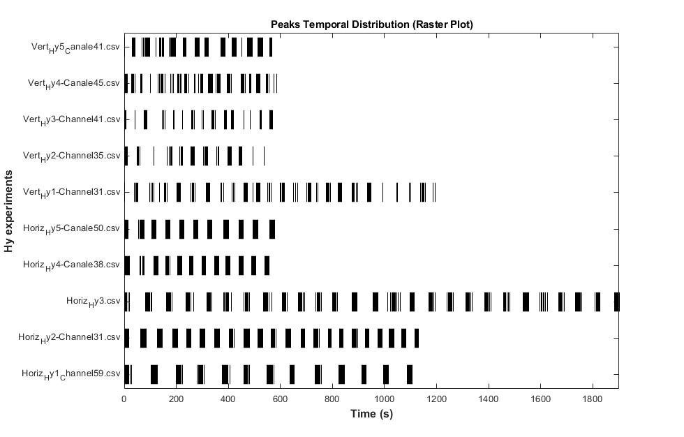
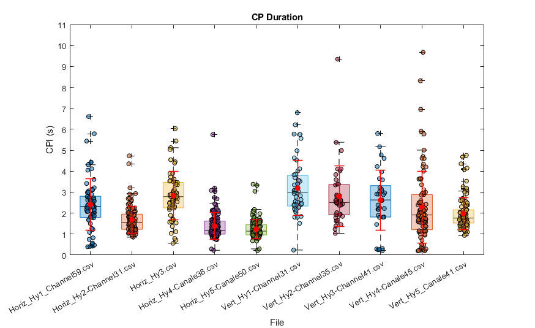
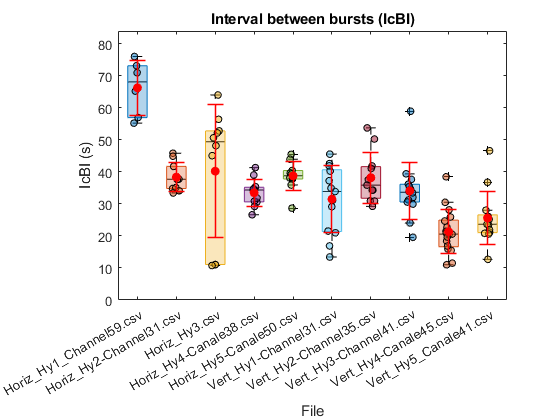
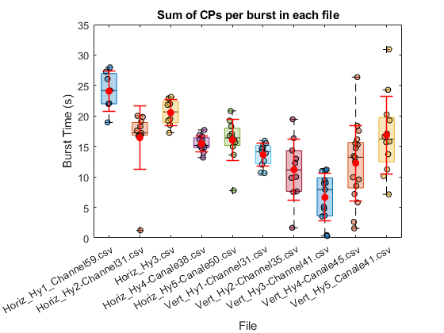
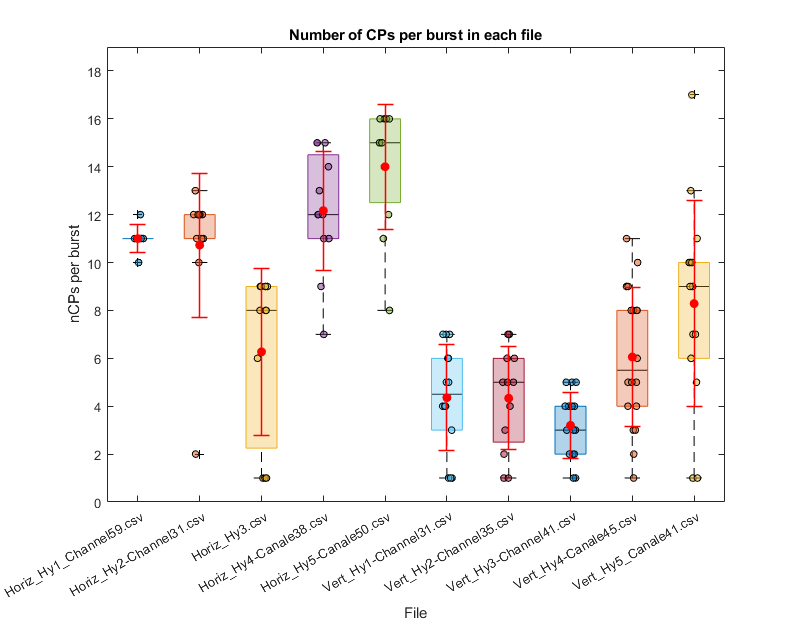
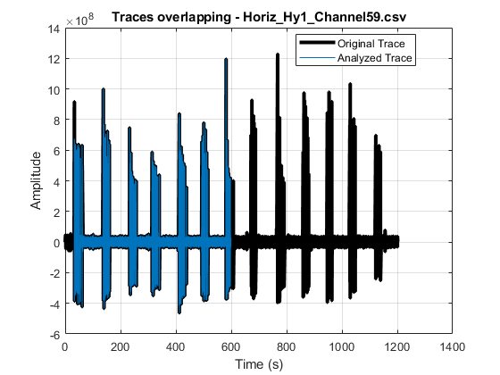
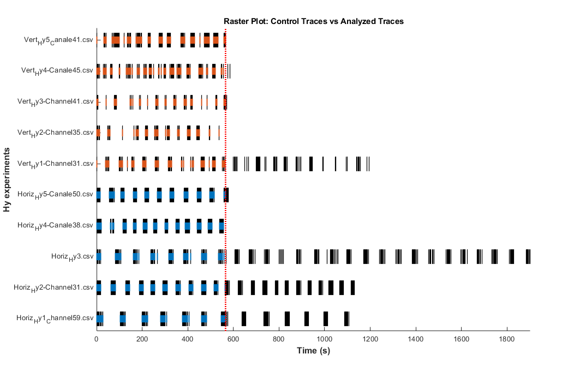

# Hy_CP_Sorting
This repository contains the MATLAB code developed for the  electrophysiological analysis of Multi-Electrode Array (MEA) recording in **Hydra vulgaris* 

## Description
The code permits to extract the extracts the main electrophysiological parameters, perform the contraction pulse (CP) sorting and compare different datasets from MEA traces recorded in vivo in **H. vulgaris* polyps. 

## Prerequisites
- Matlab version 

## Installation and Running Instructions

 
## Usage Examples
## CP Sorting and Feature extraction 

Contraction Pulses (CP) detection and feature extraction were performed from MEA recordings. First and second derivatives were calculated using the centered finite difference method for equally spaced data.
<!---->

## CP Sorting 

Temporal distribution (Raster Plot) of detected peaks in the original full-length traces 

## Feature extraction 

Hy CP Sorting computes:
• the single CP duration (CPI), their sum for burst (BurstTime) and their sum
for recording file (CTime);
• the intercontraction burst duration (IcBI) and their sum (ETime);
• the number of bursts (nBurst) and the number of IcBI (nIcBI);
• the number of CP events for each burst (nCPBurst) and recording file (nCP).

## Comparative analysis of data

Traces alignment to the duration of the shortest one to ensure consistent comparisons between recordings.

## Raster plot

Temporal distribution (Raster Plot) of detected peaks in the original full-length traces (black traces) respect to their analyzed segments (Dotted lines represent the time of the shorter traces)

